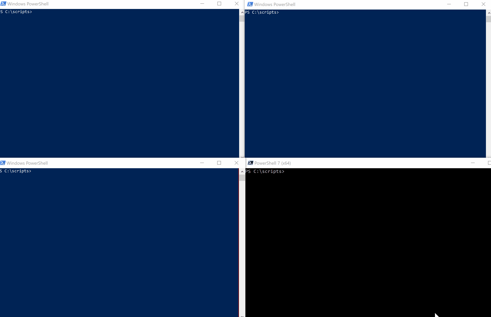

# Green Means Go - A (Visual) Mutex Demo

## What's a Mutex?

A Mutex is an operating system construct which allows processes to coordinate **Mut**ally **Ex**clusive access
to resources.  If it were a conversation between the OS and some processes it might sound a bit like this:

- Notepad: "I'd like exclusive access to write to file `C:\Temp\abc.txt`"
- OS: "It's all yours Notepad."
- VSCode: "I'd like exclusive access to write to file `C:\Temp\abc.txt`"
- OS: "Sit tight VSCode.  It's being used by someone else."
- VSCode: "Okay - let me know when it's ready."
- OS: "Will do."
- Notepad: "I'm done with file `C:\Temp\abc.txt`"
- OS: "VSCode? File `C:\Temp\abc.txt` is all yours."
- VSCode: "Thanks!"

## Why do I care?

Likely you don't. But...if your script does some Asynchronous-Fu (think [Jobs](https://docs.microsoft.com/en-us/powershell/module/microsoft.powershell.core/about/about_jobs?view=powershell-7) or [ThreadJobs](https://docs.microsoft.com/en-us/powershell/module/microsoft.powershell.core/about/about_thread_jobs?view=powershell-7)) and those
worker-jobs share a log file you're gonna **need** a mutex.  Otherwise those little jobs will be stepping
on each others log messages - log entries will be missed...exceptions will be thrown...crying and nashing
of teeth sort-of-thing.

## Okay, I'm still here.  How do I use a Mutex in PowerShell?

Because PowerShell is sitting right on top of .NET we can leverage the [System.Threading.Mutex](https://docs.microsoft.com/en-us/dotnet/api/system.threading.mutex?view=netcore-3.1) class.  With that
we can create a Mutex object in PowerShell and use the methods it provides to wait (`WaitOne()`) for exclusive access to a resource and release (`ReleaseMutex()`) access from that resource when we're done.

## Stop talking.  Demo it.

### The Setup

Each PowerShell console will run the same script which will interact using a named Mutex.  The script will count
down (progressively faster)

1. Request Mutex ownership
2. Ownership Granted
    1. Paint the console Green
    1. Log a message to a common log file
    1. Output a message to the console
    1. Sleep (make others wait for ownership)
    1. Release ownership of the named Mutex
3. Ownership **not** Granted
    1. Paint the console Red
    2. Wait for ownership of the named Mutex to be granted

- Green - Process has been granted exclusive access to the resource
- Red - Process is waiting to be granted exclusive access to the resource

### The Finish

